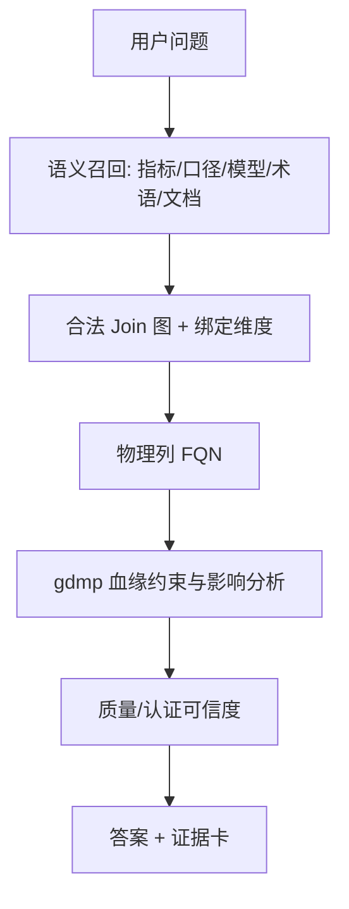

# 业务语义层 + 智能问数 一年产品迭代规划

**版本**：2.0（路线图）  
**日期**：2026-09-14  
**作者**：刘颖 / Product Owner  
**质量评分**：92/100  
**目标用户**：业务建模工程师、数据分析师、问数终端用户、数据域 Owner  
**核心 KPI**：问数「口径命中正确 + 物理表/列正确 + 可解释」的综合正确率较基线提升 ≥ 25%；答案页证据完整率 ≥ 90%（口径 + FQN + 血缘摘要至少两项）  
**依据材料**：
- 原型：`业务建模产品原型/index.html`、`智能问数/`、`shared/semantic-bridge.js`
- V1.0：`docs/business-modeling-prd.md`、`业务建模产品原型/模型与业务口径流程说明.md`
- 能力对照：OpenMetadata 2.0（Explore / Lineage / Glossary / Quality / Data Product / RBAC）——**仅作能力对照，不作为交付底座**
- 对接对象：**广联达数据中台（gdmp）元数据 / 血缘**

---

## 一、基本信息

### 1.1 参考链接

| 序号 | 标签 | 链接 | 备注 |
|------|------|------|------|
| 1 | 业务建模原型 | `业务建模产品原型/index.html` | 域/基础模型、Join、口径、文档、指标模块 |
| 2 | 智能问数原型 | `智能问数/` | 证据卡、指标维度切换、语义桥消费 |
| 3 | 语义桥 | `shared/semantic-bridge.js` | 发布模型/指标/文档、FQN、问数召回 |
| 4 | 中台血缘/目录 | gdmp 元数据服务 | 物理资产真源；接口待联调清单见附录 |
| 5 | 能力对照 | OpenMetadata 产品模块 | 不重建采集器、Explore、独立 Lineage 产品 |

### 1.2 变更记录

| 时间 | 版本号 | 变更人 | 主要变更内容 |
|------|--------|--------|--------------|
| 2026-05-29 | V1.0 | — | 业务知识库 / 域与基础模型登记 |
| 2026-09 | 原型增量 | — | 指标模块、分析维度绑定、发布到问数、证据卡、语义桥 |
| 2026-09-14 | V2.0 | 刘颖 | 一年路线图：问数准确率北极星 + gdmp 打通 + 治理/质量/数据产品 |

### 1.3 历史遗留问题

| 序号 | 所属模块 | 问题描述 |
|------|----------|----------|
| 1 | 资源区 | 建模左侧数据资源仍偏静态示意，未接 gdmp 资产检索 |
| 2 | 血缘 | 「查看血缘」为提示/示意，未打开中台真实血缘图 |
| 3 | FQN | 语义桥有字段，未作为全链路强制身份（表/列/指标） |
| 4 | 问数证据 | 有证据卡雏形，口径+物理+血缘+文档未强制齐套 |
| 5 | 指标主数据 | 建模内口径与独立指标模块存在双入口风险，需统一主数据 |
| 6 | 顶栏占位 | 资产中心 / 治理中心多为视觉占位 |
| 7 | 权限 | 仅展示修改人，无 Owner / 角色 / 认证 |
| 8 | 质量 | 无测试、事故、告警，问数无法表达「能不能信」 |

---

## 二、版本目标

**产品定位（一年不变）**

- **gdmp**：物理资产目录、端到端血缘、（后续）质量结果的**真源**。
- **本产品**：业务语义层（域/基础模型、Join、口径/指标、术语、知识文档）+ **智能问数**。
- **OpenMetadata**：能力清单与体验参照，**禁止**再做一套采集器 / Explore / 全局 Lineage 产品。

**北极星**：问数既要「问对业务含义」，也要「选对物理表列且可解释」。语义层降语义误差，中台血缘/FQN 降选表误差，质量与认证降「结果不可信」误差。

**血缘 ≠ Join（一年内产品文案必须分开）**

| | gdmp 血缘 | 建模关联配置 |
|--|-----------|----------------|
| 问题 | 数据从哪来、流到哪 | 业务对象怎么拼 |
| 边 | 流向 A → B | Join A ⋈ B |
| 维护方 | 中台采集 | 建模人员 |

### 2.1 范围增加

1. 问数成为语义资产的**一等消费端**（召回、证据、维度切换、拒答/弱答）
2. 建模资源与字段**强制锚定 gdmp FQN**，血缘从示意变为中台跳转/内嵌
3. **独立指标目录**（跨域发现与发布）；建模口径改为引用同一主数据
4. **术语库**与指标/字段同义词贯通，服务问数消歧
5. **Owner / 角色 / 认证分级**进入资产与问数可见范围
6. **数据质量**结果进入问数可信度（警告或拒绝引用脏资产）
7. **数据产品**：域对外可消费包（模型 + 指标 + 文档 + 端口）

### 2.2 功能增加

1. 已在原型实现（基线，不重复排期）：知识库目录、域/基础模型、Join、业务口径、文档挂接、指标公式与绑模型、分析维度切换、发布到问数、证据卡雏形
2. 问数证据齐套：口径公式、绑定模型、FQN、血缘摘要、文档依据、质量/认证徽标
3. gdmp 资产选择器与字段级 FQN 落库
4. 上游变更影响：模型/指标失效提示，问数降级
5. 术语 CRUD 与口径/指标别名同步
6. 指标目录：全局公共 vs 域私有、版本、启停、冲突台账
7. 资产 Owner、角色策略、认证（可对标 OM Certification/Tier，实现走中台账号）
8. 质量：消费 gdmp/DQ 结果，不自建测试引擎
9. 数据产品登记、上架、问数按产品范围检索

**明确不做（对照 OM 后裁掉）**

- 自研多源 Connector / Ingestion Pipeline 产品页
- 再造全域 Explore（用中台目录 + 本产品语义检索）
- 把 Join 图画成平台血缘
- 第二套互不同步的指标库

---

## 三、功能清单

> 按依赖排序的交付能力。每个功能仅含：展示内容、交互点、数据验证。

### 3.1 问数证据卡齐套（M1）

#### 3.1.1 展示内容

- 答案下方固定「依据」区，默认展开摘要、可展开详情。
- 摘要行：命中指标名、口径一句话、绑定模型名、分析维度（若有）。
- 详情：公式原文、`col['key']` 对应中文名、表/列 FQN、血缘上游 1～3 跳摘要、关联文档标题、质量/认证徽标（无数据时显示「未接入」灰态，不编造分数）。
- 空态：未命中已发布指标时展示「未使用标准口径」，并列出候选资产，不假装已解释。

#### 3.1.2 交互点

a. 问数结果渲染后自动带出当前命中资产的证据。  
b. 点击 FQN / 模型名：新开建模只读页或抽屉。  
c. 点击「查看血缘」：跳转或内嵌 gdmp 血缘（M2 接通后可用；M1 可灰显并提示「血缘待接入」）。  
d. 点击文档：预览已挂接知识，不打开无关 Context 全库。  
e. 「按维度查看」仅在指标绑定了分析维度且图表类型支持时出现（沿用现有 Tab 切换 GROUP BY）。

#### 3.1.3 数据验证

- 已发布指标必须有：名称、公式、至少 1 个绑定模型；缺一则问数可召回但证据标记「不完整」，不得进入「高置信」。
- 绑定分析维度必须是绑定模型字段子集；切换维度不得引入未绑定字段。
- 禁止在证据中展示未绑定 FQN 的「猜测表名」。

---

### 3.2 问数召回约束：只走已发布语义（M1）

#### 3.2.1 展示内容

- 对话中展示命中路径：指标 / 域模型 / 术语 / 文档（按优先级）。
- 低置信：展示「可能指以下口径」列表（最多 3 条）及差异点（公式、域、维度）。
- 拒答/弱答条：无已发布资产且无法消歧时，说明原因，引导去建模发布，不生成无依据 SQL 文案。

#### 3.2.2 交互点

a. 用户发送问题 → 引擎仅检索已发布语义桥资产。  
b. 多候选时用户点选一条口径后重跑。  
c. 「去完善口径」跳转建模对应指标或模型。

#### 3.2.3 数据验证

- 未发布模型/指标不得进入默认证召回。
- Join 只能使用该模型关联配置中的边；禁止临时笛卡尔或同名乱连。
- 全局公共指标与域私有指标同时命中时：优先当前问数上下文域；并列则进入点选，不得静默混用。

---

### 3.3 建模资源锚定 gdmp FQN（M2）

#### 3.3.1 展示内容

- 模型编辑「数据资源」改为中台资产检索列表：名称、库/层、FQN、Owner、更新时间。
- 画布表节点副标题展示表级 FQN；字段设置增加「物理列 FQN」列（可折叠）。
- 未锚定节点显示警示「未绑定物理资产，不可发布到问数」。

#### 3.3.2 交互点

a. 搜索/筛选 gdmp 表 → 拖入画布 = 引用资产，不复制表结构副本为真源。  
b. 字段映射：自动按列名对齐，失败行可手选列。  
c. 「查看血缘」打开该表在 gdmp 的血缘页/抽屉。  
d. 发布到问数时写入语义桥：`tableFqn` / `columnFqn` / `metricFqn`。

#### 3.3.3 数据验证

- 发布前：模型内启用字段均需列级 FQN；指标公式引用列必须能解析到 FQN。
- FQN 格式与中台一致（服务.库.模式.表[.列]）；重名中文表不得作为唯一键。
- 中台资产已下线/删除：建模显示失效，问数对该资产降为不可高置信。

---

### 3.4 上游变更影响与问数降级（M2）

#### 3.4.1 展示内容

- 模型/指标列表增加「链路」列：正常 / 上游变更 / 资产失效。
- 详情提示：变更类型（字段删除、表更名、作业失败摘要——以后两者以中台回传为准）。
- 问数证据卡在降级时显示黄色「物理链路变更，结果需人工确认」。

#### 3.4.2 交互点

a. 中台血缘/元数据变更回调或定时同步 → 刷新语义资产状态。  
b. Owner 可「确认仍有效」或「重新映射字段」后恢复正常。  
c. 问数侧不提供「忽略并强行查询」给普通用户（管理员除外，待权限模块）。

#### 3.4.3 数据验证

- 列 FQN 在中台不存在 → 绑定该列的指标不可保持「已发布可用」。
- 仅描述类元数据变更（Owner、标签）不阻断问数。

---

### 3.5 术语库与口径别名贯通（M3）

#### 3.5.1 展示内容

- 治理入口「术语」：术语名、同义词、关联指标/字段、所属域、状态。
- 指标编辑页可引用术语；问数命中同义词时证据显示「经术语：xxx → 指标：yyy」。

#### 3.5.2 交互点

a. 新建/编辑术语，绑定 1 个主指标或 1 个维度字段。  
b. 从口径名称一键「沉淀为术语」。  
c. 问数检索包含术语同义词。

#### 3.5.3 数据验证

- 同一域内术语名唯一；同义词不得指向两个已发布且公式不同的指标（冲突则禁止保存，提示去冲突台账）。
- 未发布术语不参与问数召回。

---

### 3.6 独立指标目录（主数据唯一）（M3）

#### 3.6.1 展示内容

- 一级或治理中心下「指标」：名称、作用域（全局公共/特定域）、公式摘要、绑定模型数、分析维度、状态、版本、Owner。
- 建模「业务口径」Tab：以引用目录指标为主，允许「从模型字段生成并登记到目录」。
- 冲突台账：统一 / 冲突 / 可能重复（沿用口径校验语义）。

#### 3.6.2 交互点

a. 目录创建指标（布局与现有「业务口径」公式编辑器一致：运算符、数据列树、双击插入）。  
b. 建模内「同步度量」= 登记或更新目录条目，不另存一套。  
c. 发布后语义桥与问数只读目录已发布版本。  
d. 历史版本只读查看，回滚需二次确认。

#### 3.6.3 数据验证

- 一套主数据：禁止目录与口径 Tab 出现同名不同公式且均「已发布」。
- 全局公共指标绑模型校验：公式字段 + 分析维度必须在目标模型存在（沿用现有规则）。
- 特定域指标不可在未授权域问数会话默认证召回。

---

### 3.7 资产 Owner、角色与认证（M4）

#### 3.7.1 展示内容

- 模型、指标、数据产品、术语卡片展示 Owner、角色（负责人/专家）、认证（如未认证/已认证）、分级（若中台有 Tier 则只读展示）。
- 问数证据卡同步徽标；无权限资产不出现在召回列表。

#### 3.7.2 交互点

a. Owner 转让、认证申请/撤销（审批流可先手工状态，后接中台账号）。  
b. 只读用户隐藏发布、删除、改公式。  
c. 认证变更立即影响问数「高置信」资格。

#### 3.7.3 数据验证

- 发布到问数：建议（可配置）要求存在 Owner；无 Owner 时允许发布但不得标高置信。
- 角色与中台账号映射失败时保存拦截，提示「未绑定中台用户」。

---

### 3.8 质量结果进入问数可信度（M5）

#### 3.8.1 展示内容

- 模型/表资源展示中台质量摘要：通过/失败用例数、最近事故、更新时间。
- 问数：质量失败时答案区警告或拒绝「作为确定结论」；仍展示证据与失败项名称。
- 不提供自建测试用例编辑器（对照 OM Tests：消费即可）。

#### 3.8.2 交互点

a. 「查看质量」跳转中台质量详情。  
b. Owner 可将某失败项标记「问数忽略」（需权限），忽略原因必填。  
c. 告警只订阅到 Owner，不在问数聊天里刷屏。

#### 3.8.3 数据验证

- 无质量数据：徽标为「未监测」，不视为通过。
- 阻断级失败（规则由中台定义）→ 问数不得输出确定数值，只输出解释与引导。

---

### 3.9 数据产品（域对外交付包）（M6）

#### 3.9.1 展示内容

- 数据产品：名称、所属域、包含的已发布模型/指标/文档、可见范围、Owner、FQN（域.产品名）。
- 问数侧可按「产品」限定检索范围（会话或入口选择产品）。

#### 3.9.2 交互点

a. 从域下创建产品，勾选已发布资产加入 Input/Output（先做资产清单，端口契约可简化为「可问/可引」）。  
b. 上架/下架；下架后问数不再以该产品为范围，资产仍可被其它入口召回（除非同时取消发布）。  
c. 消费者打开产品页查看口径与文档，再进入问数。

#### 3.9.3 数据验证

- 仅已发布且 FQN 完整的资产可加入产品。
- 产品必须归属一个数据域；全局指标可被多个产品引用，删除产品不删除指标主数据。

---

## 四、研发周期

排期按**依赖里程碑**，不绑定财季；项目管理可再映射到具体月份。建议团队在 M1 与 M2 连续交付，M3 起可与问数体验并行。

| 阶段 | 范围 | 交付标准 | 备注 |
|------|------|----------|------|
| 基线 | 已实现原型能力 | 建模 + 指标 + 发布问数 + 维度切换可用 | 不重复开发 |
| **M1** | 3.1、3.2 | 无依据不装确定答案；已发布口径优先；Join 不越权 | 北极星第一跳，可先 mock 血缘字段 |
| **M2** | 3.3、3.4 | 发布强制 FQN；血缘打开 gdmp；上游变更可降级 | 卡点：gdmp 检索/血缘/变更 API |
| **M3** | 3.5、3.6 | 单一指标主数据；术语消歧进问数 | 消化双入口 |
| **M4** | 3.7 | 无权限不可召回；高置信依赖 Owner/认证策略 | 依赖中台账号 |
| **M5** | 3.8 | 质量失败可警告/阻断问数 | 消费中台 DQ，不自建引擎 |
| **M6** | 3.9 | 域可上架产品；问数可按产品检索 | 对标 OM Data Product 体验，数据在 gdmp+本产品 |

**建议节奏（供排期，非承诺）**：M1～M2 为上线问数可用性的最短路径；M3 为准确率第二跳；M4～M5 为可信度；M6 为规模化复用。

---

## 附录

### 与 OpenMetadata 模块对照（只对照，不复制产品）

| OM 模块 | 我们的策略 |
|---------|------------|
| Services / Ingestion | 不自建；物理采集在 gdmp |
| Explore | 不重建全域目录；语义检索 + 中台跳转 |
| Lineage | 建模只引用；问数展示摘要 + 跳转 |
| Glossary | M3 自建业务术语，可与中台术语映射 |
| Metrics / KPI | M3 指标目录，问数主召回 |
| Data Quality / Incident / Alert | M5 消费中台结果 |
| Domain / Data Product | 已有板块-数据域；M6 上架产品 |
| Tags / Tier / Certification / RBAC | M4 对齐中台账号与策略 |
| Insights / Ask | 不做 OM 运营看板；问数是我们的 Ask |

### 风险与依赖

| 风险 | 概率 | 影响 | 缓解措施 |
|------|------|------|----------|
| gdmp 资产检索/血缘 API 不齐 | 中 | M2 无法闭环 | M1 先用占位 FQN；接口清单提前冻结 |
| 口径与指标目录双写 | 高 | 问数召回分裂 | M3 强制单一主数据，迁移脚本一次切 |
| 质量规则过严导致问数全拒 | 中 | 体验崩溃 | 分警告/阻断级；默认警告 |
| 把 Join 当血缘做进需求 | 中 | 架构回退 | 评审清单固定两条边语义 |

### 术语表

| 术语 | 定义 |
|------|------|
| FQN | 物理或逻辑资产全限定名，跨建模/血缘/问数的唯一锚点 |
| 语义桥 | 已发布模型、指标、文档的运行时资产，供问数消费 |
| 分析维度 | 指标允许切换的 GROUP BY 字段白名单 |
| 数据产品 | 某域对外可发现、可问、带 Owner 的已发布资产包 |

### 待确认事项

- [ ] gdmp 表/列检索、血缘图、元数据变更、DQ 摘要的接口契约与环境
- [ ] 高置信是否强制 Owner + 认证 + 质量通过（建议可配置，默认 Owner 必填）
- [ ] 问数多租户/工程隔离是否复用「所属工程」
- [ ] 中文知识文档预览与编码（历史 Context 类问题）是否纳入 M1 或单独缺陷

---

*本文档由 product-requirements 技能交互生成。OpenMetadata 仅作能力对照。*
