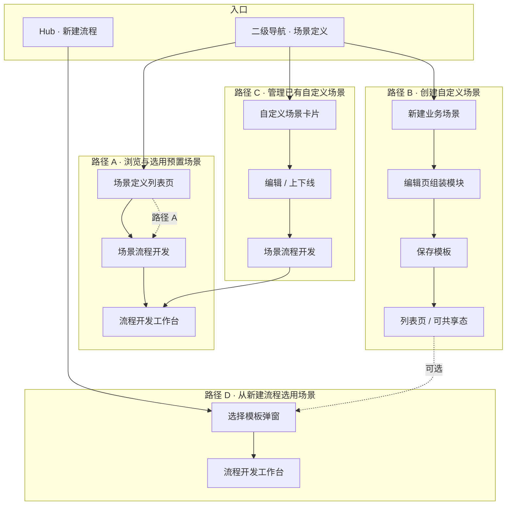
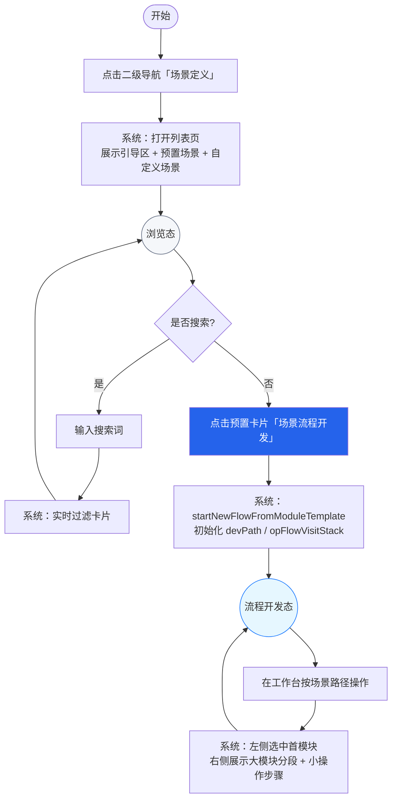
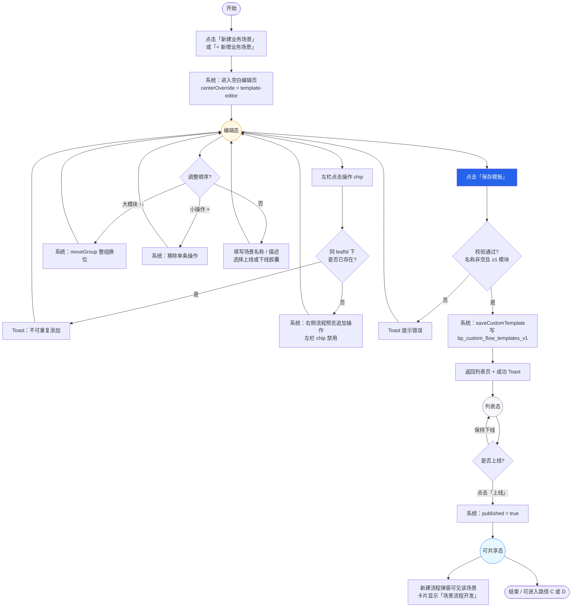
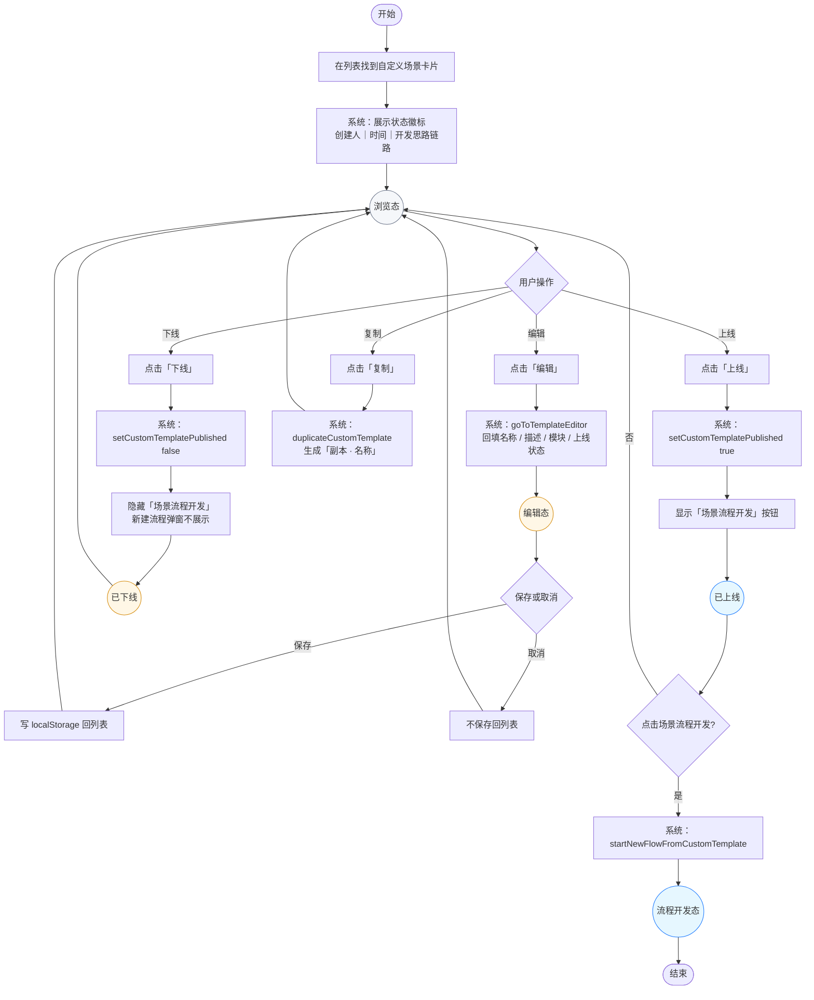
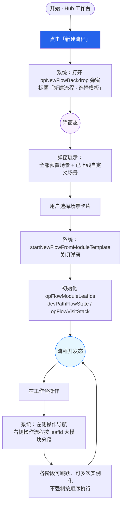
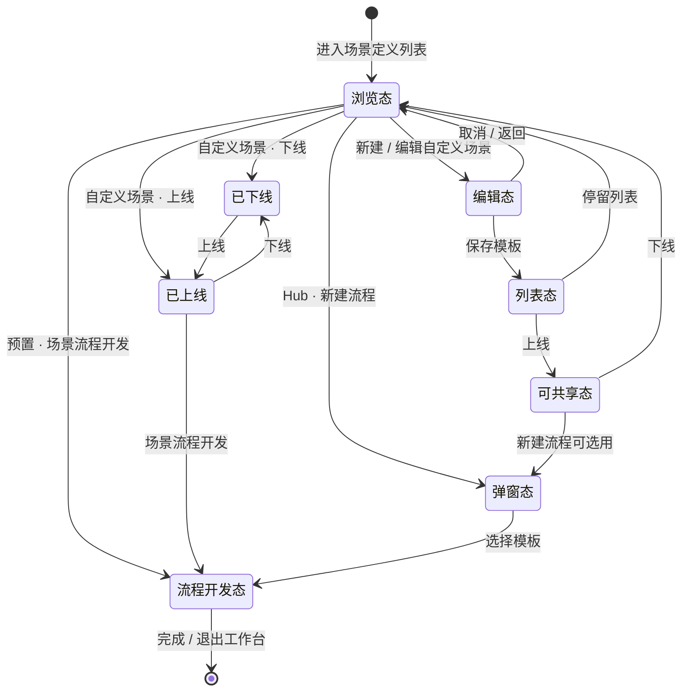

# 场景定义 · 用户操作流程图

> 数据来源：`Sheet4-用户操作逻辑.csv`  
> 对应原型：`业务流程产品原型/index.html` · 场景定义模块

---

## 总览：四条用户路径



---

## 路径 A · 浏览与选用预置场景

| 步骤 | 用户操作 | 系统响应 | 结果状态 |
|------|----------|----------|----------|
| 1 | 点击二级导航「场景定义」 | 打开列表页，展示引导 + 预置 + 自定义 | 浏览态 |
| 2 | （可选）输入搜索词 | 过滤卡片 | 浏览态 |
| 3 | 点击预置卡片「场景流程开发」 | `startNewFlowFromModuleTemplate` 进入工作台 | 流程开发态 |
| 4 | 在工作台操作 | 左侧首模块选中，右侧展示操作流程分段 | 流程开发态 |



---

## 路径 B · 创建自定义场景

| 步骤 | 用户操作 | 系统响应 | 结果状态 |
|------|----------|----------|----------|
| 1 | 点击「+ 新增业务场景」 | 进入空白编辑页 | 编辑态 |
| 2 | 左栏点击操作 chip | 右侧追加；同 leafId 不可重复 | 编辑态 |
| 3 | （可选）大模块 ↑↓ | 整组与相邻大模块交换 | 编辑态 |
| 4 | （可选）小操作 × | 移除该操作；左栏 chip 恢复可点 | 编辑态 |
| 5 | 填写名称、描述，选择上线/下线 | 表单赋值 | 编辑态 |
| 6 | 点击「保存模板」 | 校验 → 写 localStorage → 回列表 Toast | 列表态 |
| 7 | （可选）点击「上线」 | 新建流程弹窗可见该场景 | 可共享态 |



---

## 路径 C · 管理已有自定义场景

| 步骤 | 用户操作 | 系统响应 | 结果状态 |
|------|----------|----------|----------|
| 1 | 列表找到自定义卡片 | 展示徽标、创建人、时间、开发思路 | 浏览态 |
| 2 | 点击「编辑」 | 回填名称、描述、模块顺序、上线状态 | 编辑态 |
| 3 | 点击「下线」 | published=false，按钮变「上线」 | 已下线 |
| 4 | 点击「上线」 | published=true，显示「场景流程开发」 | 已上线 |
| 5 | 已上线时点击「场景流程开发」 | 进入工作台 | 流程开发态 |



---

## 路径 D · 从新建流程选用场景

| 步骤 | 用户操作 | 系统响应 | 结果状态 |
|------|----------|----------|----------|
| 1 | Hub 页点击「新建流程」 | 打开「选择模板」弹窗 | 弹窗态 |
| 2 | 选择预置或已上线自定义卡片 | `startNewFlowFromModuleTemplate` | 流程开发态 |
| 3 | 进入工作台 | 操作流程按场景分组展示 | 流程开发态 |



---

## 状态机总图（结果状态流转）



---

## 使用说明

| 文件 | 说明 |
|------|------|
| `Sheet4-用户操作逻辑.csv` | Excel 原始步骤表 |
| 本文档 | Mermaid 流程图，可在 VS Code / Cursor / GitHub 中预览 |
| 在线渲染 | 复制代码块到 [Mermaid Live Editor](https://mermaid.live) 可导出 PNG/SVG |

### 导出为图片（可选）

```bash
# 需安装 @mermaid-js/mermaid-cli
npx @mermaid-js/mermaid-cli -i flow.mmd -o flow.png
```
