# 业务建模 · 模型与业务口径流程说明

> **文档版本**：V1.1  
> **原型基线**：`业务定义页面还原.html`  
> **范围**：模型 Tab、业务口径 Tab 的使用流程、内部逻辑及两模块间的数据引用关系  
> **关联文档**：[产品交互说明.md](./产品交互说明.md)、[业务知识库-Phase1-PRD.md](./业务知识库-Phase1-PRD.md)

---

## 1. 总览

业务建模右侧内容区通过三个 Tab 组织知识对象：

| Tab | 内部标识 | 主要内容 |
|-----|----------|----------|
| **模型** | `data-model` | 域模型、基础模型列表与编辑 |
| **业务口径** | `indicator-model` | 维度表（左）、指标表（右） |
| **文档** | `document` | 知识文档（本文档不展开） |

**模型** 与 **业务口径** 是同一业务建模链路的两段：

1. 在 **模型** 中定义表关联、字段语义（维度 / 度量）；
2. 通过 **字段快捷同步** 将启用字段推送到 **业务口径**；
3. 在 **业务口径** 中补充指标口径、计算公式、下钻维度，并完成唯一性校验与启停管理。

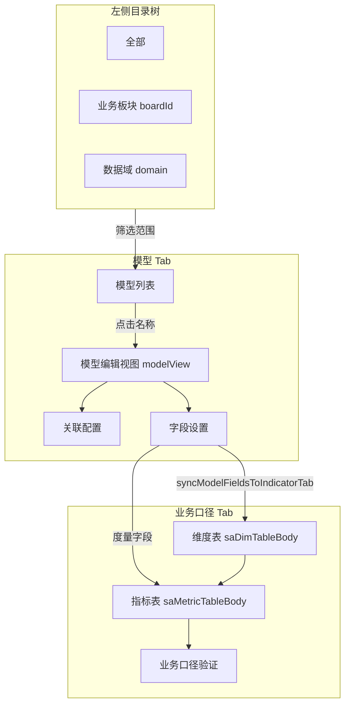

---

## 2. 页面与视图结构

### 2.1 视图互斥关系

| 视图 ID | 何时显示 | 说明 |
|---------|----------|------|
| `listView` | 默认；从模型/原子指标详情返回 | 含工具栏 + 三 Tab + 列表面板 |
| `modelView` | 进入域模型 / 基础模型编辑 | 关联配置 + 字段设置 |
| `atomicIndicatorView` | 从主列表进入原子指标详情 | 与业务口径 Tab **独立**，见 §8 |

同一时刻只显示一个主视图；侧滑抽屉（文档预览、挂接模型等）叠加在上层。

### 2.2 全局状态变量（模块协作关键）

| 变量 | 作用 |
|------|------|
| `currentListCatalog` | 当前 Tab：`data-model` / `indicator-model` / `document` |
| `selectedNodeId` | 左侧树选中节点，驱动列表范围筛选 |
| `currentModelName` | 当前编辑中的模型名称 |
| `currentModelType` | `域模型` 或 `基础模型` |
| `currentModelRowId` | 当前模型在列表中的 `rowId` |
| `editingSaMetricRow` | 业务口径「编辑指标」弹窗正在编辑的行 |

**模型 → 业务口径同步** 依赖 `currentModelName` 或 `currentModelRowId`：未打开模型编辑时，同步函数直接跳过。

---

## 3. 模型 Tab 使用流程

### 3.1 列表能力

**可见行类型**（`rowMatchesListCatalog`）：

- 域模型
- 基础模型

> 原子指标、文件行仍在 DOM 中，但被模型 Tab 过滤隐藏。

**列表列（模型 Tab 显示）**：

复选框 → 名称 → 描述 → 类型 → 所属分类 → 关联模型 → 修改人 → 修改时间 → 操作  

（扩展信息、归属范围列在模型 Tab 下 CSS 隐藏）

**筛选链路**（`applyTableControls`）：

```
列头筛选 + 树范围(rowMatchesTreeScope) + 全局搜索(listSearchQuery) + Catalog 类型
  → 排序(tableSortState) → 分页(每页 15 条)
```

**工具栏**：

- 搜索名称/描述
- 清空筛选
- **新建** 下拉：创建域模型 / 创建基础模型 / 创建原子指标

### 3.2 创建域模型

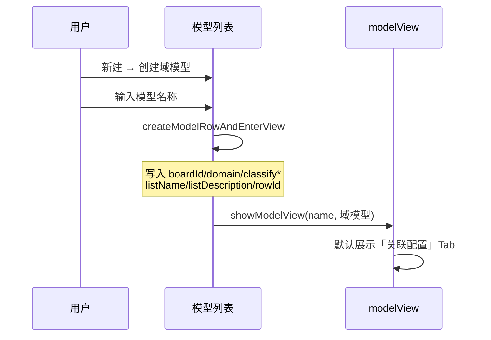

- 分类默认来自 **当前树选中节点**（`getRowClassifyDefaults`）
- 创建后 **立即进入编辑**，不留在列表

### 3.3 创建基础模型

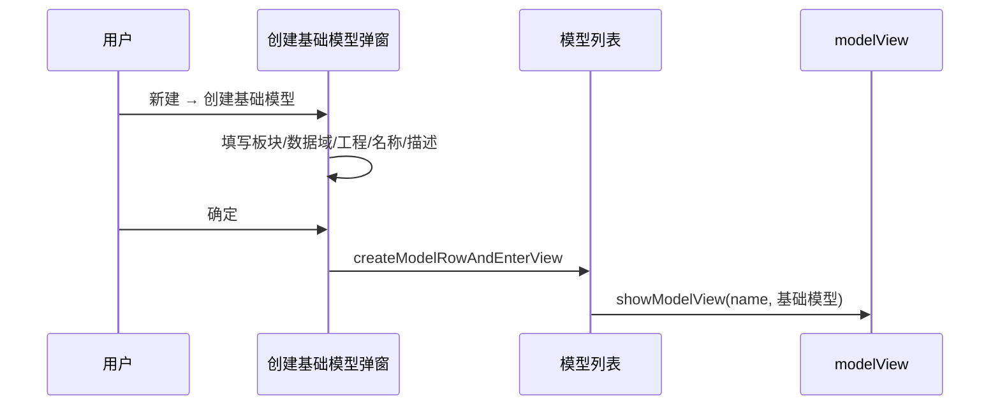

弹窗字段：业务板块、数据域、所属工程、模型名称、描述（打开时随机预填板块/域/工程供核对）。

### 3.4 模型编辑视图（modelView）

| 能力 | 域模型 | 基础模型 |
|------|--------|----------|
| 关联配置 | 域模型关系画布（占位布局） | Join 画布、表拖拽、数据预览、Join 配置 |
| 字段设置 | 按关联表生成字段表 | 同左 |
| 切换模型 | 有 | 无 |
| 关联文档 | 有 | 有 |
| 保存 | 同步到业务口径 + postMessage | 同左 |

**Tab 切换**：

- **关联配置**：展示关系画布；基础模型支持表节点点击预览
- **字段设置**：`renderFieldSettingsFromRelationCanvas()` 根据画布表节点生成字段分组表

### 3.5 字段设置 · 语义与同步开关

字段表核心列：

| 列 | 说明 |
|----|------|
| 语义类型 | 主键 / 维度 / 度量 |
| 快捷指标/维度 | 开关：是否同步到业务口径 |

**语义 → 业务口径映射**：

| 语义类型 | 同步目标 | 默认开关 |
|----------|----------|----------|
| 主键 | 不同步 | 禁用 |
| 维度 | 左侧 **维度表** | 开启 |
| 度量 | 右侧 **指标表** | 开启 |

用户关闭开关后写入 `row.dataset.quickIndicatorUserOff = "1"`，该字段不再参与同步。

**触发同步的时机**：

1. 切换模型 Tab 为「字段设置」并完成渲染  
2. 修改语义类型或快捷开关  
3. 点击模型顶栏 **保存**  
4. 切换到 **业务口径** Tab（`initIndicatorModelPanel`）

---

## 4. 业务口径 Tab 使用流程

### 4.1 布局与数据组成

切换至业务口径 Tab 后：

- 隐藏主列表（`#listCatalogTableWrap`）
- 显示左右分栏（`indicator-split-layout`）
- 工具栏切换为：搜索 + **创建指标** + **批量操作**

| 区域 | DOM | 列 |
|------|-----|-----|
| 左：维度 | `#saDimTableBody` | 复选框、中文名、所属分类、创建人、状态、操作 |
| 右：指标 | `#saMetricTableBody` | 复选框、中文名、所属分类、**业务口径验证**、创建人、状态、操作 |

**指标表数据来源（三类混合）**：

1. **种子数据**：页面预置 Excel 风格维度/指标（`data-key="excel_*"`）
2. **模型同步行**：`data-sync-source="model-field"`，由字段设置推送
3. **用户新建**：「创建指标」弹窗写入

左右表 **独立分页**（各 15 条/页），共用顶部搜索框（对行文本模糊匹配）。

### 4.2 创建 / 编辑指标

**入口**：

- 工具栏「创建指标」
- 指标行操作「编辑」

**表单字段**：

| 字段 | 必填 | 存储 |
|------|------|------|
| 指标名称 | ✓ | 行中文名列 |
| 英文名称 | ✓ | `dataset.key` |
| 业务口径 | ✓ | `dataset.businessCaliber` |
| 下钻维度 | 可选 | `dataset.drillDimensions`（JSON 数组） |
| 计算口径类型 | ✓ | 按度量/指标/字段（原型表单） |
| 计算公式 | ✓ | `dataset.formula` |
| 启用状态 | 默认已启用 | `dataset.saStatus` |

**保存流程**：

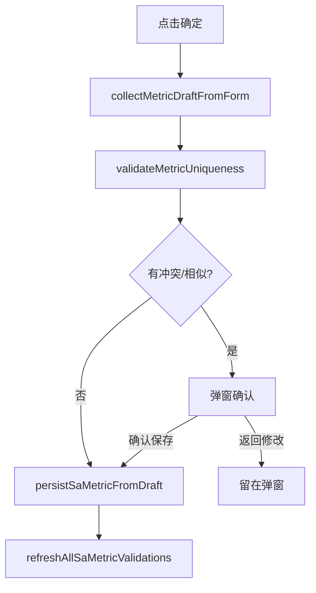

### 4.3 业务口径验证规则

**比对范围**：同一 **业务板块**（`classifyBoardId`）内所有指标。

**主判据**：计算公式字符串 `trim()` 后 **完全一致**。

| 级别 | 条件 | 列表标签 | 保存时 |
|------|------|----------|--------|
| 统一 | 无问题 | 统一（绿） | 直接保存 |
| 强冲突 | 同数据域 + 公式相同 | 冲突（红） | 强提示弹窗，可确认保存 |
| 弱提示 | 不同数据域 + 公式相同 | 可能重复（橙） | 普通警告弹窗，可确认保存 |
| 辅助 | 公式不同，但下钻维度或业务口径文本重叠 | 口径相似（蓝） | 轻提示弹窗，可确认保存 |

悬停标签或 `i` 图标可查看冲突的数据域与指标名称。

### 4.4 状态与批量操作

**单行**：操作列「停用」↔「启用」，同步更新状态列（已启用 / 未启用）。

**批量操作**（工具栏下拉）：

| 操作 | 说明 |
|------|------|
| 批量删除 | 删除勾选行并刷新校验 |
| 批量启用 | 状态 → 已启用 |
| 批量停用 | 状态 → 未启用 |
| 批量验证 | 重算勾选指标的业务口径验证列 |

---

## 5. 两模块间的数据引用关系

### 5.1 核心同步函数

`syncModelFieldsToIndicatorTab(options)` 是 **模型 → 业务口径** 的唯一正式通道。

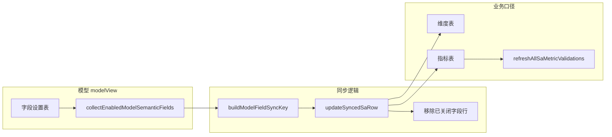

**执行步骤**：

1. `getCurrentModelSyncId()` → `currentModelRowId` 或 `draft:{模型名}`
2. `getCurrentModelClassify()` → 从模型行或树默认取 `boardId` / `domain`
3. `collectEnabledModelSemanticFields()` → 采集开关开启的维度/度量字段
4. 对每个字段：
   - 生成 `syncKey = {modelId}::{分组表名}::{英文字段名}`
   - 度量 → 指标表；维度 → 维度表
   - 查找或创建 `tr[data-sync-source="model-field"]`
   - `updateSyncedSaRow` 更新 DOM 与 dataset
5. 删除该模型下已不再启用的同步行
6. 刷新分页；指标表执行 `refreshAllSaMetricValidations`

### 5.2 同步行标识与字段映射

**同步行 dataset（关键）**：

| 字段 | 说明 |
|------|------|
| `syncSource` | 固定 `"model-field"` |
| `syncModelId` | 模型同步 ID（见上） |
| `syncKey` | 全局唯一同步键 |
| `syncGroup` | 字段分组（通常对应关联表名） |
| `semantic` | `"维度"` 或 `"指标"` |
| `classifyBoardId` / `classifyDomain` | 所属分类（与模型一致） |
| `formula` | 指标：由 `agg(字段名)` 等生成 |
| `businessCaliber` | 指标：字段别名等业务描述 |
| `saStatus` | 启用状态，默认已启用 |

**模型字段 → 指标行内容示例**：

| 模型侧 | 业务口径侧 |
|--------|------------|
| 字段别名「销量」 | 中文名列 |
| 语义=度量，聚合=sum | `formula` = `sum(excel_xl)` |
| 所属板块/域 | 所属分类列 |
| 快捷开关开启 | 出现/更新同步行 |
| 快捷开关关闭 | 同步行被移除 |

### 5.3 分类与树筛选字段对照

系统中存在两套相近的归属字段，用途不同：

| 字段对 | 主要用途 |
|--------|----------|
| `boardId` / `domain` | 左侧树 **列表范围筛选**；文档/原子指标 scope 判断 |
| `classifyBoardId` / `classifyDomain` | 列表 **「所属分类」列**；业务口径表分类；**指标唯一性校验**的板块/域比对 |

创建模型或指标时，通常 **四套字段一并赋值**；后续可通过 `applyRowListClassify` 单独修正展示分类。

**树筛选规则**（`rowMatchesTreeScope`）：

| 树节点 | 列表可见行 |
|--------|------------|
| 全部 | 所有行 |
| 业务板块 | `boardId` 匹配 |
| 数据域 | `boardId` + `domain` 同时匹配 |

### 5.4 引用关系总表

| 来源模块 | 目标模块 | 引用方式 | 数据载体 |
|----------|----------|----------|----------|
| 模型 · 字段设置 | 业务口径 · 维度表 | 自动同步 | `syncKey` + 行 DOM |
| 模型 · 字段设置 | 业务口径 · 指标表 | 自动同步 | 同上 + `formula` |
| 模型 · 列表行 | 模型 · 编辑视图 | 点击名称 | `currentModelRowId` |
| 模型 · 保存 | 业务口径 | 触发同步 | 无额外存储，实时写 sa 表 |
| 业务口径 · 指标 | 业务口径 · 指标 | 唯一性校验 | 比对 `formula` / `drillDimensions` / `businessCaliber` |
| 左侧树 | 模型列表 / 文档列表 | 范围筛选 | `boardId` / `domain` |
| 左侧树 | 新建默认分类 | 默认值 | `getRowClassifyDefaults()` |

---

## 6. 泳道图

以下泳道图按 **参与角色 / 系统模块** 划分通道，展示主流程中的职责边界与数据流向。图中箭头表示触发顺序或数据传递方向。

### 6.1 端到端主流程：建模 → 口径发布

覆盖从目录筛选、模型创建编辑、字段同步到业务口径维护的完整链路。

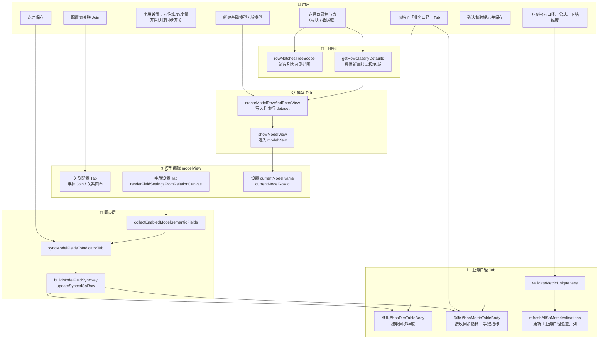

### 6.2 模型 Tab：创建与进入编辑

区分 **域模型**（prompt 快速创建）与 **基础模型**（弹窗表单）两条路径。

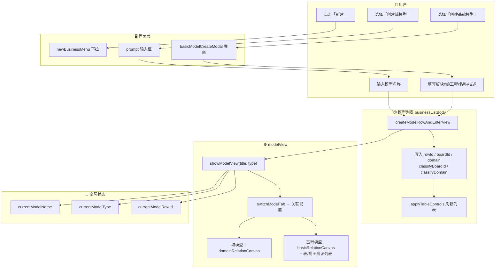

### 6.3 跨模块：模型字段 → 业务口径同步

展示 `syncModelFieldsToIndicatorTab` 在各模块间的数据引用与行级标识。

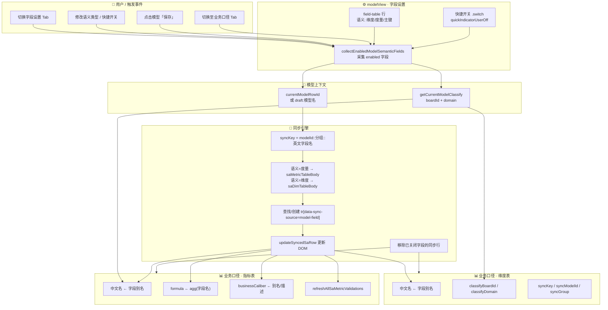

**同步行关键 dataset 传递**：

```
模型字段行                    业务口径行
─────────────────────────────────────────────
fieldKey                  →  syncKey（含 modelId）
分组表名                    →  syncGroup
别名 aliasName            →  中文名列
boardId / domain          →  classifyBoardId / classifyDomain
聚合函数 + 英文名          →  formula（仅指标）
```

### 6.4 业务口径 Tab：指标创建与唯一性校验

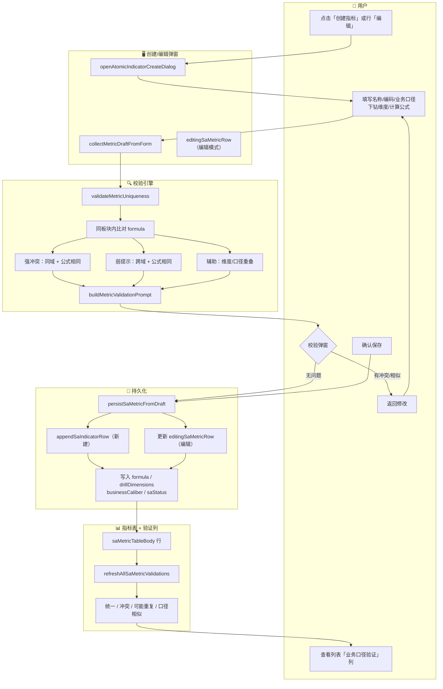

### 6.5 指标启停与批量操作

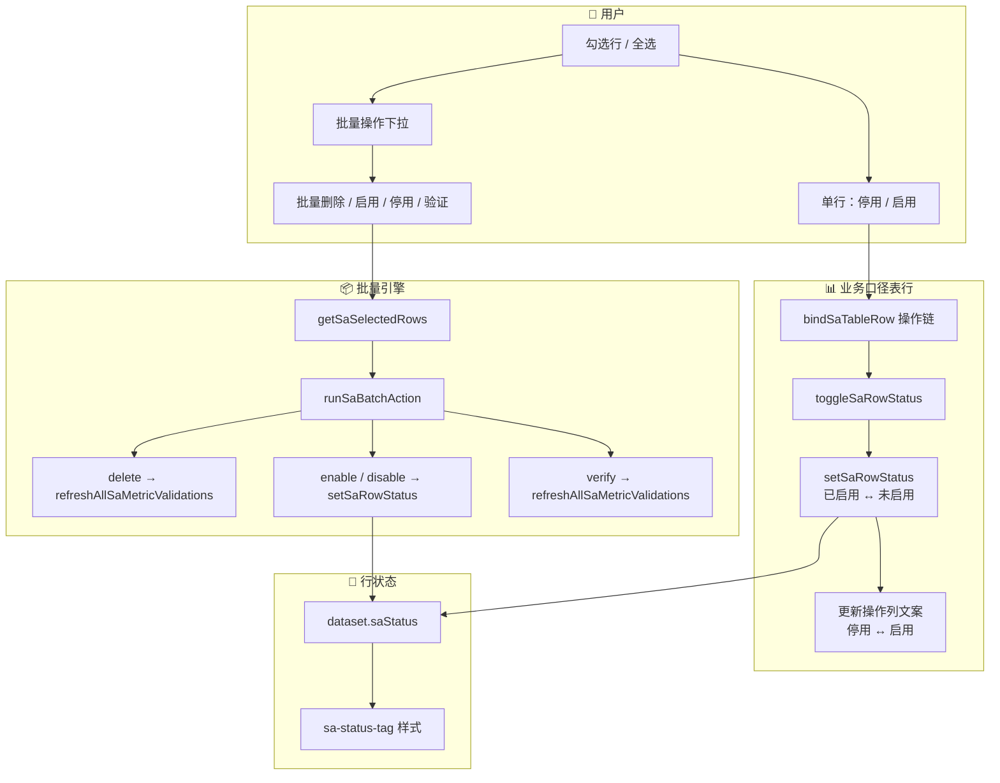

### 6.6 模块间数据引用一览（泳道总图）

从 **数据载体** 视角汇总模型与业务口径之间的引用关系。

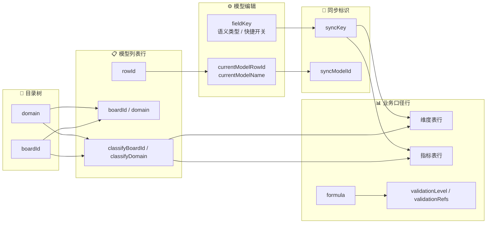

| 泳道 | 写出字段 | 读入方 |
|------|----------|--------|
| 目录树 | `boardId`, `domain` | 模型列表筛选、新建默认分类 |
| 模型列表行 | `rowId`, `classify*` | modelView 上下文、同步 syncModelId |
| 模型字段 | `fieldKey`, 语义, 开关 | 同步引擎 → 业务口径行 |
| 同步层 | `syncKey` | 维度/指标表定位与增量更新 |
| 指标表 | `formula`, `drillDimensions`, `businessCaliber` | 唯一性校验引擎 |

---

## 7. 端到端用户旅程

### 7.1 标准路径：建模 → 口径发布

> 泳道视角见 **§6.1**；以下为时序视角补充。

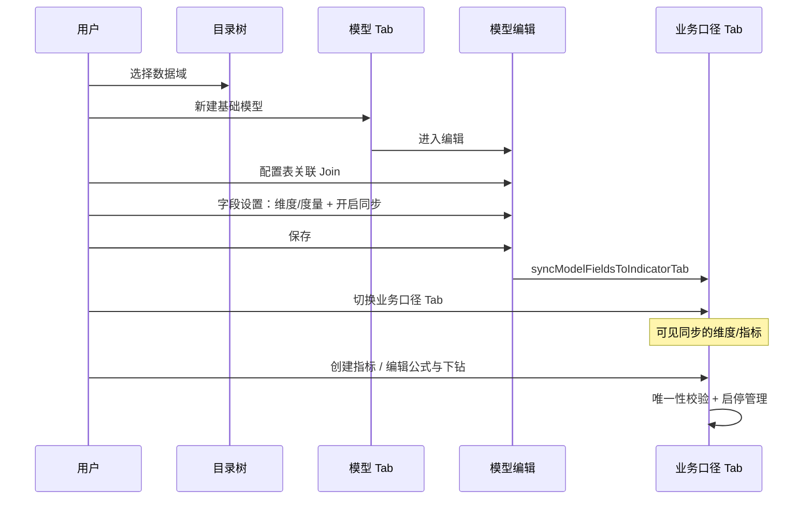

### 7.2 在业务口径直接创建指标（不经过模型字段）

- 工具栏「创建指标」→ 填写完整表单 → 写入 **指标表**（非同步行）
- 分类默认来自当前树选中节点（`getRowClassifyDefaults`）
- 与模型字段 **无 syncKey 关联**，但参与同一板块内的公式唯一性校验

### 7.3 编辑已有模型并增量同步

1. 模型列表点击名称 → `showModelView`
2. 字段设置中 **新增度量** 或 **打开快捷开关**
3. 保存或切换至业务口径 Tab
4. 新业务口径行出现；已有 `syncKey` 的行被 **更新** 而非重复插入

---

## 8. 原型边界与概念区分

阅读或评审时需注意以下设计边界：

### 8.1 三种「指标」概念

| 概念 | 所在位置 | 创建入口 | 与模型同步 |
|------|----------|----------|------------|
| **原子指标** | 主列表（模型 Tab 不展示） | 新建 → 创建原子指标 | 否，独立 `atomicIndicatorView` |
| **业务口径指标** | 业务口径 Tab 右表 | 创建指标弹窗 | 可选（用户手建） |
| **模型同步指标** | 业务口径 Tab 右表 | 模型字段设置自动推送 | 是，`sync-source=model-field` |

### 8.2 模型 Tab 不展示原子指标

`rowMatchesListCatalog("data-model")` 仅包含域模型、基础模型。原子指标通过独立详情页维护，**不进入**业务口径左右分栏（除非未来产品打通）。

### 8.3 同步的前置条件

`syncModelFieldsToIndicatorTab` 在以下情况 **不执行**：

- 未打开过任何模型编辑（无 `currentModelName` / `currentModelRowId`）
- 业务口径表 DOM 未就绪

因此：**先建模、再口径** 是原型中的主路径；直接进业务口径 Tab 仅能看到种子数据与用户手建指标。

### 8.4 业务口径维度表

维度主要来自：

1. 模型字段（语义=维度 + 开关开启）同步  
2. 种子数据  

维度 **不参与** 计算公式唯一性校验（校验仅针对指标表）。

---

## 9. 关键函数索引

| 函数 | 模块 | 职责 |
|------|------|------|
| `switchListCatalog` | Tab | 切换模型/业务口径/文档，联动工具栏与面板 |
| `showModelView` | 模型 | 进入模型编辑，设置全局模型上下文 |
| `createModelRowAndEnterView` | 模型 | 创建列表行并跳转编辑 |
| `renderFieldSettingsFromRelationCanvas` | 模型 | 生成字段设置表 |
| `collectEnabledModelSemanticFields` | 模型 | 采集可同步字段 |
| `syncModelFieldsToIndicatorTab` | **跨模块** | 模型字段 → 业务口径表 |
| `initIndicatorModelPanel` | 业务口径 | 初始化搜索/分页/批量操作 |
| `openAtomicIndicatorCreateDialog` | 业务口径 | 打开创建/编辑指标弹窗 |
| `validateMetricUniqueness` | 业务口径 | 公式/口径/维度校验 |
| `refreshAllSaMetricValidations` | 业务口径 | 刷新验证列标签 |
| `applyTableControls` | 模型列表 | 筛选/排序/分页 |
| `rowMatchesTreeScope` | 公共 | 树范围过滤 |
| `getRowClassifyDefaults` | 公共 | 新建对象默认板块/域 |

---

## 10. 附录：行级数据字段速查

### 10.1 模型列表行（域模型 / 基础模型）

```
rowId, boardId, domain, classifyBoardId, classifyDomain,
project(基础模型), listName, listDescription
```

### 10.2 业务口径 · 维度/指标行（通用）

```
key, classifyBoardId, classifyDomain, saStatus
```

### 10.3 业务口径 · 指标行（额外）

```
formula, businessCaliber, drillDimensions(JSON),
validationLevel, validationRefs(JSON)
```

### 10.4 业务口径 · 模型同步行（额外）

```
syncSource=model-field, syncModelId, syncKey, syncGroup, semantic
```

### 10.5 模型字段设置行

```
fieldKey, fieldLabel, data-field-name, lastSemanticType,
quickIndicatorUserOff
```

---

## 11. 修订记录

| 版本 | 日期 | 说明 |
|------|------|------|
| V1.1 | 2026-07-08 | 补充 §6 泳道图（主流程、创建编辑、字段同步、指标校验、批量操作、数据引用总图） |
| V1.0 | 2026-07-08 | 初版：模型 Tab、业务口径 Tab 流程与跨模块引用关系 |

---

**文档维护**：若原型中 Tab 命名、校验规则或同步逻辑变更，请同步更新本文 §3–§5、§6 泳道图与函数索引。
