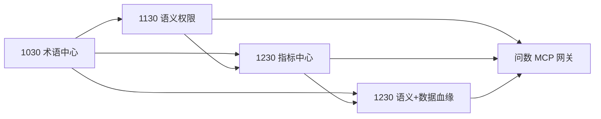

# 语义建模产品 · 里程碑迭代计划（1030–1230）

> **版本**：V1.0  
> **编制日期**：2026-09-28  
> **范围**：业务建模 · 术语中心 / 语义权限 / 指标中心 / 语义血缘与数据血缘  
> **原型基线**：`index.html`、`term-module.js`、`metric-module.js`、`lineage-module.js`、`shared/semantic-bridge.js`  
> **说明**：● 核心交付　○ 依赖/联调/增强　**MCP** = 面向智能问数等消费端的语义查询接口

---

## 1. 总览

| 序号 | 里程碑 | 总故事（Epic） | 子任务 | 功能模块 | 类型 |
|:---:|:------:|----------------|--------|----------|------|
| **1** | **1030** | 术语中心建设 | 1.1 / 1.2 | 术语中心、结构语义、SemanticBridge、术语 MCP | 能力 |
| **2** | **1130** | 语义权限体系 | 2.1 / 2.2 / 2.3 | 权限中心、行权限引擎、问数 MCP 网关 | 能力 |
| **3** | **1230** | 指标中心建设 | 3.1 / 3.2 / 3.3 | 指标中心、审核流引擎、指标 MCP | 能力 |
| **4** | **1230** | 语义血缘 + 数据血缘 | 4.1 / 4.2 | 语义首页、血缘平台、影响分析 | 挑战 |

### 1.1 里程碑验收汇总

| 里程碑 | Epic | 必达验收标准（摘要） | 挑战验收标准 |
|:------:|------|----------------------|--------------|
| **1030** | 术语中心 | 术语 CRUD + 批量 + 域/模型挂载 + 上下线；字段映射可查；术语 MCP 可用；AI 工地 ≥ 5 条标准 query | — |
| **1130** | 语义权限 | 平台角色接入；销售域 + 本部门行权限；问数/MCP 权限透传一致 | — |
| **1230** | 指标中心 | 指标 CRUD + 批量 + 域/模型 + 上下线；审核流上线；指标 MCP 可用 | — |
| **1230** | 语义 + 数据血缘 | 四视角语义浏览 API 化 | 物理血缘接入；字段级影响分析；MCP 影响查询 |

### 1.2 功能模块 × 里程碑矩阵

| 功能模块 | 1030 | 1130 | 1230 | 说明 |
|----------|:----:|:----:|:----:|------|
| **术语中心** `term-module.js` | ● | ○ | ○ | 1.1 核心交付 |
| **术语映射 / field-terms** | ● | ○ | ○ | 1.2 核心交付 |
| **结构语义 · 字段设置** | ● | ○ | ○ | 1.2 挂载入口 |
| **SemanticBridge** | ● | ● | ● | 语义包导出 |
| **术语 MCP** | ● | ○ | ○ | 1.2 新建 |
| **权限中心** | | ● | ○ | 2.1 新建 |
| **行权限引擎** | | ● | ○ | 2.2 新建 |
| **问数 MCP 网关** | ○ | ● | ● | 2.3/3.3 新建，1230 增强 |
| **指标中心** `metric-module.js` | ○ | ○ | ● | 3.1 核心交付 |
| **审核流引擎** | | | ● | 3.2 新建 |
| **指标 MCP** | | ○ | ● | 3.3 新建 |
| **语义首页** `lineage-module.js` | ○ | ○ | ● | 4.1 挑战强化 |
| **血缘平台对接** | | | ● | 4.2 挑战新建 |
| **影响分析** | | | ● | 4.2 挑战新建 |
| **智能问数（消费端）** | ● | ● | ● | 各阶段 MCP 联调 |

### 1.3 依赖关系

---

## 2. 【能力】1030 术语中心建设

**总用户故事**

> **作为** 业务数据治理人员，**我希望** 建设统一的术语中心并完成与模型字段的映射及 MCP 输出，**以便** AI 工地等场景可通过智能问数准确理解业务语言。

**MVP 闭环**：新建 10 条术语 → CSV 再导入 20 条 → 批量挂域/模型 → 上线 → 字段挂载 → MCP 查询 → AI 工地标准问句命中。

---

### 2.1 子任务 1.1 · 术语新建 + 批量上传 + 挂载域/模型 + 上下线

| 维度 | 内容 |
|------|------|
| **功能模块** | `term-module.js` · 术语中心 Tab · 批量操作弹层 · `shared-nav-tree.js` · 列表工具栏 |
| **关联页面** | 语义模型 → 术语中心；结构语义 → 字段设置（术语列） |
| **现状** | **已有**：新建/编辑、CSV 四步导入、多选域、多选生效模型、上下线、批量移动域/上下线/删除 |
| **增量** | 批量上传体验对齐 PRD；挂载「域 + 模型」关系校验；与后端 API 对接（替换 localStorage） |

| 子任务 ID | 功能点 | 用户故事 | 验收标准 | 模块/接口 |
|-----------|--------|----------|----------|-----------|
| 1.1.1 | 术语新建 | 作为业务顾问，我要新建术语并绑定数据域与生效模型 | 必填：名称、域（可多选）、模型（可多选）；重名校验；保存后可上下线 | 术语中心 · 创建弹窗 |
| 1.1.2 | 批量上传 | 作为业务顾问，我要 CSV 批量导入术语 | 四步向导；模式：新增/更新/覆盖；非法行预览；模板下载 | 术语中心 · 批量导入 |
| 1.1.3 | 挂载域 | 作为业务顾问，我要为术语指定所属数据域 | 列表展示域；批量移动域（多选目标域）；域变更后模型挂载自动过滤 | 术语中心 · 列表/批量 |
| 1.1.4 | 挂载模型 | 作为建模人员，我要指定术语在哪些模型生效 | 创建/编辑多选生效模型；详情展示生效模型清单 | 术语中心 · 创建/详情 |
| 1.1.5 | 上下线 | 作为治理人员，我要控制术语是否可被挂载/问数消费 | 单条/批量上下线；未上线术语不可被字段/指标挂载；状态列筛选 | 术语中心 · 操作列 |
| 1.1.6 | 持久化/API | 作为平台管理员，我要术语数据落库并可多端同步 | API CRUD 完成；localStorage 迁移脚本；变更事件 `biz-terms-updated` | 术语服务 API |

---

### 2.2 子任务 1.2 · 术语↔模型字段映射查询 + AI 工地 MCP 输出

| 维度 | 内容 |
|------|------|
| **功能模块** | `term-module.js`（field-terms map）· `index.html` 字段设置 · `semantic-bridge.js` · **术语 MCP 服务**（新建） |
| **关联页面** | 结构语义 → 模型编辑 → 字段设置；术语中心 → 详情（关联字段） |
| **现状** | **已有**：字段推荐/挂载、术语详情关联字段、SemanticBridge 基础导出 |
| **增量** | 映射查询 API；MCP Tool 定义；AI 工地试点 query 联调 |

| 子任务 ID | 功能点 | 用户故事 | 验收标准 | 模块/接口 |
|-----------|--------|----------|----------|-----------|
| 1.2.1 | 字段→术语挂载 | 作为建模人员，我要为模型字段挂载已上线术语 | 推荐/手动/移除；写入 field-terms map；同字段仅 1 个主术语 | 结构语义 · 字段设置 |
| 1.2.2 | 术语→字段反查 | 作为数据顾问，我要查某术语被哪些模型哪些字段使用 | 术语详情展示「关联字段」清单（模型名+字段名）；可跳转模型 | 术语中心 · 详情抽屉 |
| 1.2.3 | 映射查询 API | 作为消费端，我要按术语/字段/模型查询映射关系 | 支持：`getByTerm` / `getByField` / `getByModel`；返回 FQN、域、状态 | 术语映射 API |
| 1.2.4 | MCP：查术语 | 作为智能问数，我要通过 MCP 查询术语定义与同义词 | Tool：`search_terms`；入参：keyword/domain；出参：name、synonyms、description、domain | 术语 MCP |
| 1.2.5 | MCP：查字段映射 | 作为智能问数，我要查术语对应物理/逻辑字段 | Tool：`get_term_field_mapping`；出参：model、field、fqn、online | 术语 MCP |
| 1.2.6 | AI 工地场景验证 | 作为产线负责人，我要 AI 工地标准问句能命中术语语义 | ≥ 5 条试点 query（如「合同额」「目标额」）MCP 返回正确术语+字段 | 场景 · AI 工地一阶段 |

---

## 3. 【能力】1130 语义权限体系

**总用户故事**

> **作为** 平台安全管理员，**我希望** 语义建模引入平台岗位/角色并支持行级权限，且问数 MCP 透传权限，**以便** 不同角色只看到授权范围内的语义与数据。

**MVP 闭环**：配置销售角色 → 仅销售域 + 本部门 → 术语列表 / 问数 / MCP 三处数据范围一致。

---

### 3.1 子任务 2.1 · 引入平台岗位、角色权限

| 维度 | 内容 |
|------|------|
| **功能模块** | **权限中心（新建）** · 平台 IAM 对接 · 术语/指标/模型列表 · 操作按钮权限控制 |
| **现状** | **新建** |

| 子任务 ID | 功能点 | 用户故事 | 验收标准 | 模块/接口 |
|-----------|--------|----------|----------|-----------|
| 2.1.1 | 平台角色同步 | 作为管理员，我要同步平台岗位/角色到语义模块 | 调用平台 IAM API；角色列表可映射到语义资源 | 权限中心 · 角色同步 |
| 2.1.2 | 语义资源权限模型 | 作为架构师，我要定义术语/指标/模型/文档的 RBAC | 动作：查看/编辑/发布/删除；资源：按域/模型粒度 | 权限模型文档 |
| 2.1.3 | 页面操作鉴权 | 作为普通用户，无权限时我不能编辑/发布/删除 | 按钮级隐藏或禁用；越权 API 返回 403 + 明确提示 | 术语/指标/模型 UI |
| 2.1.4 | 数据域可见范围 | 作为用户，我只能看到有权限的数据域下资产 | 左侧树、列表、语义首页筛选仅展示授权域 | 全局筛选 · 树 |

---

### 3.2 子任务 2.2 · 行权限（域 + 组织维度）

| 维度 | 内容 |
|------|------|
| **功能模块** | **行权限引擎（新建）** · 模型 rowFilter 配置 · 指标维度策略 · 预览/问数注入 |
| **场景示例** | 销售角色 → 仅「销售域」+ 仅本部门 `dept_id` |

| 子任务 ID | 功能点 | 用户故事 | 验收标准 | 模块/接口 |
|-----------|--------|----------|----------|-----------|
| 2.2.1 | 域级行权限 | 作为销售角色，我只能看销售业务域的术语/指标/模型 | 角色绑定 allowedDomains；列表/图谱/MCP 自动过滤 | 行权限 · 域策略 |
| 2.2.2 | 组织级行权限 | 作为销售角色，我只能看本销售部门数据 | 角色绑定 orgScope（如 dept_id=当前用户部门）；rowFilter 注入 | 行权限 · 组织策略 |
| 2.2.3 | 模型 rowFilter 配置 | 作为建模人员，我要为模型配置默认行过滤字段 | 模型编辑可设 filter 字段（如 dept_id、project_id） | 结构语义 · 模型编辑 |
| 2.2.4 | 指标查询过滤 | 作为销售用户，问数结果不含其他部门数据 | 指标查询自动附加 rowFilter；无权限维度值不返回 | 指标服务 · 查询层 |
| 2.2.5 | 权限预览 | 作为管理员，我要模拟某角色看到的数据范围 | 「以 XX 角色预览」开关；建模预览/列表同步 | 权限中心 · 模拟 |

---

### 3.3 子任务 2.3 · 消费端（智能问数）查询 MCP 能力（含权限）

| 维度 | 内容 |
|------|------|
| **功能模块** | **问数 MCP 网关（新建）** · `semantic-bridge.js` · 智能问数消费端 |
| **现状** | SemanticBridge 有 `toQueryEngineModels`；无 MCP、无权限透传 |

| 子任务 ID | 功能点 | 用户故事 | 验收标准 | 模块/接口 |
|-----------|--------|----------|----------|-----------|
| 2.3.1 | MCP 鉴权 | 作为问数服务，MCP 调用需携带用户身份 | OAuth/Token 透传；无效身份拒绝 | MCP 网关 · Auth |
| 2.3.2 | MCP：查语义包 | 作为问数，我要拉取当前用户可见的语义包 | Tool：`get_semantic_package`；返回模型/指标/术语（已过滤权限） | 问数 MCP |
| 2.3.3 | MCP：执行指标查询 | 作为问数，我要在权限范围内查指标值 | Tool：`query_metric`；自动注入 rowFilter；越权返回空或 403 | 问数 MCP |
| 2.3.4 | MCP：权限说明 | 作为问数，我要知道当前用户的数据范围 | Tool：`get_user_data_scope`；返回 domains、orgScope | 问数 MCP |
| 2.3.5 | 联调验收 | 作为产线负责人，销售/管理员两角色问数结果不同 | 同一 query，销售仅本部门；管理员看全域 | 智能问数 · 联调 |

---

## 4. 【能力】1230 指标中心建设

**总用户故事**

> **作为** 指标管理员，**我希望** 建设指标中心（含批量、审核、MCP 输出），**以便** 指标可治理、可审核、可被智能问数安全消费。

**MVP 闭环**：CSV 导入指标 → 提交审核 → 审核通过 → 上线 → MCP 查指标 → 问数返回答案 + 口径。

---

### 4.1 子任务 3.1 · 指标新建 + 批量上传 + 挂载域/模型 + 上下线

| 维度 | 内容 |
|------|------|
| **功能模块** | `metric-module.js` · 指标中心 Tab · 指标编辑页 · 绑定模型抽屉 · 术语挂载抽屉 |
| **现状** | **已有**：新建/编辑、公式/SQL、绑定模型、术语挂载、上下线、批量操作 |
| **增量** | 指标 CSV 批量导入（对齐术语）；API 落库；域/模型挂载规则强化 |

| 子任务 ID | 功能点 | 用户故事 | 验收标准 | 模块/接口 |
|-----------|--------|----------|----------|-----------|
| 3.1.1 | 指标新建 | 作为指标管理员，我要创建指标并绑定域、模型、术语 | 必填：名称、业务口径、关联模型、关联术语；code 自动生成 | 指标中心 · 编辑页 |
| 3.1.2 | 批量上传 | 作为指标管理员，我要 CSV 批量导入指标 | 模板：名称、口径、公式、域、模型；校验失败行可预览 | 指标中心 · 批量导入 |
| 3.1.3 | 挂载域 | 作为指标管理员，我要指定指标所属数据域 | 列表展示域；批量移动域；域与模型一致性校验 | 指标中心 · 列表 |
| 3.1.4 | 挂载模型 | 作为指标管理员，我要绑定指标依赖的语义模型 | 绑定模型抽屉校验：公式字段 ⊆ 模型字段；业务日期/维度齐全 | 指标中心 · 绑定抽屉 |
| 3.1.5 | 上下线 | 作为治理人员，我要控制指标是否可被问数消费 | 单条/批量上下线；未上线不进 SemanticBridge | 指标中心 · 操作列 |
| 3.1.6 | 持久化/API | 作为平台管理员，我要指标数据落库 | API CRUD；`glodon.biz-metrics.v7` 迁移 | 指标服务 API |

---

### 4.2 子任务 3.2 · 指标审核流程

| 维度 | 内容 |
|------|------|
| **功能模块** | **审核流引擎（新建）** · 指标中心 · 待办中心 · 通知 |
| **现状** | **新建**（原型仅有发布状态，无审核） |

| 子任务 ID | 功能点 | 用户故事 | 验收标准 | 模块/接口 |
|-----------|--------|----------|----------|-----------|
| 3.2.1 | 状态机 | 作为指标管理员，提交后进入待审而非直接发布 | 状态：草稿→待审→已通过/已驳回→已发布；驳回必填原因 | 审核流 · 状态机 |
| 3.2.2 | 待办列表 | 作为审核员，我要在待办中处理指标审核 | 待办 Tab；展示提交人、变更摘要、提交时间 | 待办中心 |
| 3.2.3 | 审核对比 | 作为审核员，我要对比本次与上一版差异 | diff：公式、口径、绑定模型/术语/维度 | 指标中心 · 审核页 |
| 3.2.4 | 审核通过发布 | 作为审核员，通过后指标才可上线/同步问数 | 仅 approved 可 publish；自动写审计日志 | 审核流 · 发布 |
| 3.2.5 | 驳回重提 | 作为提交人，驳回后我要修改并重新提交 | 驳回通知；回到草稿可编辑；重新提交进待办 | 指标中心 · 工作流 |

---

### 4.3 子任务 3.3 · 消费端（智能问数）查询 MCP 能力

| 维度 | 内容 |
|------|------|
| **功能模块** | 问数 MCP 网关 · `semantic-bridge.js` · `metric-module.js`（公式解析） |

| 子任务 ID | 功能点 | 用户故事 | 验收标准 | 模块/接口 |
|-----------|--------|----------|----------|-----------|
| 3.3.1 | MCP：查指标 | 作为问数，我要按名称/域搜索已发布指标 | Tool：`search_metrics`；出参：name、formula、caliber、domain、models | 指标 MCP |
| 3.3.2 | MCP：查指标详情 | 作为问数，我要获取指标完整语义 | Tool：`get_metric_detail`；含术语、维度、图表样式、依赖字段 | 指标 MCP |
| 3.3.3 | MCP：查指标值 | 作为问数，我要执行指标查询（含 1130 权限） | Tool：`query_metric`；继承 rowFilter；仅 online+approved 指标 | 问数 MCP |
| 3.3.4 | MCP：指标证据 | 作为问数，我要返回指标口径与文档证据 | Tool：`get_metric_evidence`；含业务口径、挂接文档 chunk | 指标 MCP |
| 3.3.5 | 联调验收 | 作为产线负责人，AI 工地/成本场景指标问数可用 | ≥ 10 条标准指标 query 通过；含权限场景 | 智能问数 · 联调 |

---

## 5. 【挑战】1230 语义血缘 + 数据血缘

**总用户故事**

> **作为** 数据治理人员，**我希望** 多视角浏览语义血缘并打通字段级数据血缘做影响分析，**以便** 变更前评估对指标与下游的影响。

**挑战闭环**：语义首页看「合同额」术语链 → 开启物理层 → 点字段做影响分析 → 显示受影响指标 → 导出报告。

---

### 5.1 子任务 4.1 · 多视角语义模型浏览

| 维度 | 内容 |
|------|------|
| **功能模块** | `lineage-module.js` · 语义首页 Tab · 筛选工具栏 · 详情面板 |
| **现状** | **已有**：术语/模型/指标/文档四视角；有向树；域节点；缩放平移 |
| **增量** | 与 API 血缘数据对接；影响分析入口；大图性能 |

| 子任务 ID | 功能点 | 用户故事 | 验收标准 | 模块/接口 |
|-----------|--------|----------|----------|-----------|
| 4.1.1 | 四视角浏览 | 作为数据顾问，我要切换术语/模型/指标/文档视角看血缘 | 视角切换；左侧列表联动；展开 1–3 层 | 语义首页 · 血缘图 |
| 4.1.2 | 筛选与搜索 | 作为数据顾问，我要按工程/域/状态筛选血缘 | 工程、域、搜索、仅已上线/已发布 | 语义首页 · 工具栏 |
| 4.1.3 | 节点详情与跳转 | 作为数据顾问，我要点节点看详情并跳转源模块 | 右侧面板；跳转术语/指标/模型/文档中心 | 语义首页 · 详情 |
| 4.1.4 | 关系类型展示 | 作为数据顾问，我要区分挂载/派生/归属/依赖等关系 | 图例：实线/虚线；关系标签 | 语义首页 · 图例 |
| 4.1.5 | 语义血缘 API | 作为前端，我要从服务端获取语义血缘子图 | API：`get_semantic_lineage(view, rootId, depth)` | 语义血缘 API |

---

### 5.2 子任务 4.2 · 打通数据血缘 + 字段级影响分析

| 维度 | 内容 |
|------|------|
| **功能模块** | **血缘平台对接（新建）** · 结构语义「查看血缘」· 语义首页（物理层）· **影响分析（新建）** |
| **现状** | upstream 占位「待接入血缘平台」；语义层 MVP 已有 |

| 子任务 ID | 功能点 | 用户故事 | 验收标准 | 模块/接口 |
|-----------|--------|----------|----------|-----------|
| 4.2.1 | 数据血缘接入 | 作为建模人员，我要看模型/字段的物理上下游 | 对接血缘平台 API；展示 upstream/downstream/FQN | 结构语义 · 血缘抽屉 |
| 4.2.2 | 语义+物理双层 | 作为数据顾问，我要在语义首页可选展示物理血缘层 | 开关「显示物理血缘」；语义节点连到表/字段节点 | 语义首页 · 双层图 |
| 4.2.3 | 字段级血缘 | 作为治理人员，我要看到指标依赖到物理字段的链路 | 指标→模型字段→物理字段 FQN 全链路 | 血缘 API · 字段级 |
| 4.2.4 | 影响分析 | 作为建模人员，字段变更前我要知道影响哪些指标 | 输入：model+field 或 FQN；输出：受影响指标/模型/问数场景列表 | 影响分析 · 引擎 |
| 4.2.5 | 影响分析报告 | 作为治理人员，我要导出影响分析结果 | 报告含：变更对象、影响指标、严重级别、建议动作 | 影响分析 · 报告 |
| 4.2.6 | MCP：影响查询 | 作为智能问数/开发工具，我要 MCP 查询字段影响 | Tool：`analyze_field_impact`；返回 metrics、models、affectedQueries | 血缘 MCP |

---

## 6. MCP Tool 清单汇总

| Tool 名称 | 里程碑 | 所属 Epic | 说明 |
|-----------|:------:|-----------|------|
| `search_terms` | 1030 | 术语中心 | 按 keyword/domain 查术语 |
| `get_term_field_mapping` | 1030 | 术语中心 | 术语→模型字段映射 |
| `get_semantic_package` | 1130 | 语义权限 | 拉取当前用户可见语义包 |
| `get_user_data_scope` | 1130 | 语义权限 | 返回用户域/组织数据范围 |
| `query_metric` | 1130/1230 | 权限/指标 | 权限范围内查指标值 |
| `search_metrics` | 1230 | 指标中心 | 搜索已发布指标 |
| `get_metric_detail` | 1230 | 指标中心 | 指标完整语义 |
| `get_metric_evidence` | 1230 | 指标中心 | 指标口径与文档证据 |
| `analyze_field_impact` | 1230 | 血缘（挑战） | 字段变更影响分析 |

---

## 7. 排期建议

| 时间段 | 重点 Epic | 交付物 |
|--------|-----------|--------|
| 9/29 – 10/12 | 1.1 术语 CRUD + 批量 | 术语 API、批量导入验收 |
| 10/13 – 10/26 | 1.2 字段映射 + 术语 MCP + AI 工地 | MCP 联调、场景验收 |
| 10/27 – 11/23 | 2.1–2.3 权限体系 | IAM 对接、行权限、问数 MCP |
| 11/24 – 12/07 | 3.1 指标 CRUD + 批量 | 指标 API、批量导入 |
| 12/08 – 12/15 | 3.2–3.3 审核 + 指标 MCP | 审核流、问数联调 |
| 12/16 – 12/30 | 4.1–4.2 血缘（挑战） | 语义 API、物理血缘、影响分析 |

---

## 8. 关联文档

| 文档 | 路径 |
|------|------|
| 业务知识库 Phase 1 PRD | `业务知识库-Phase1-PRD.md` |
| 产品交互说明 | `产品交互说明.md` |
| 模型与业务口径流程 | `模型与业务口径流程说明.md` |
| 原型主文件 | `index.html` |

---

*文档维护：与原型实现进度及 OpenSpec 变更同步更新。*
